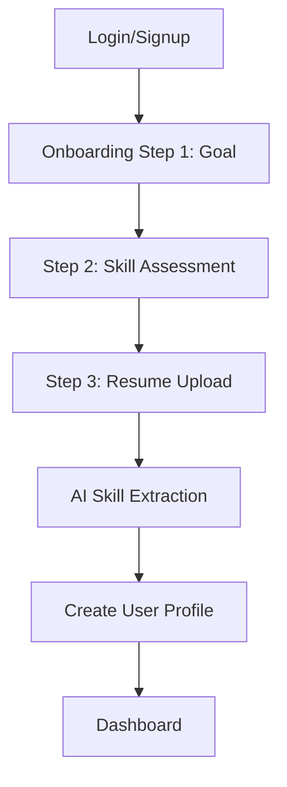
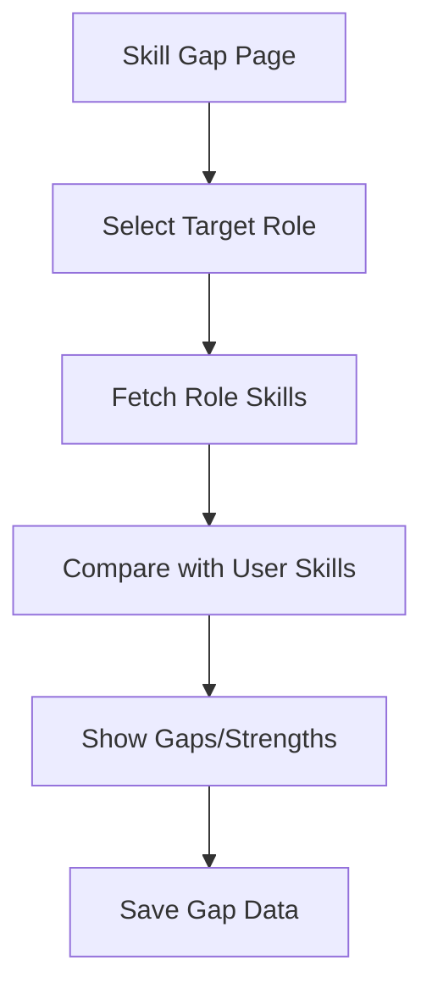
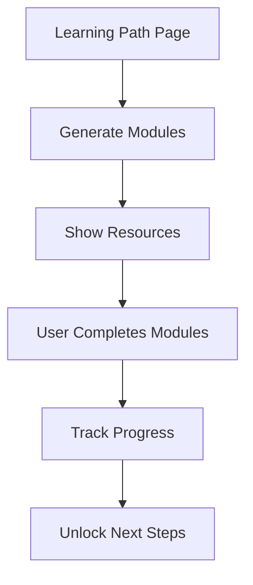
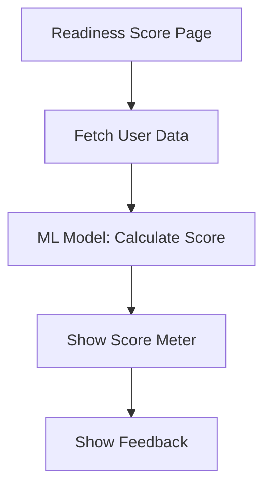
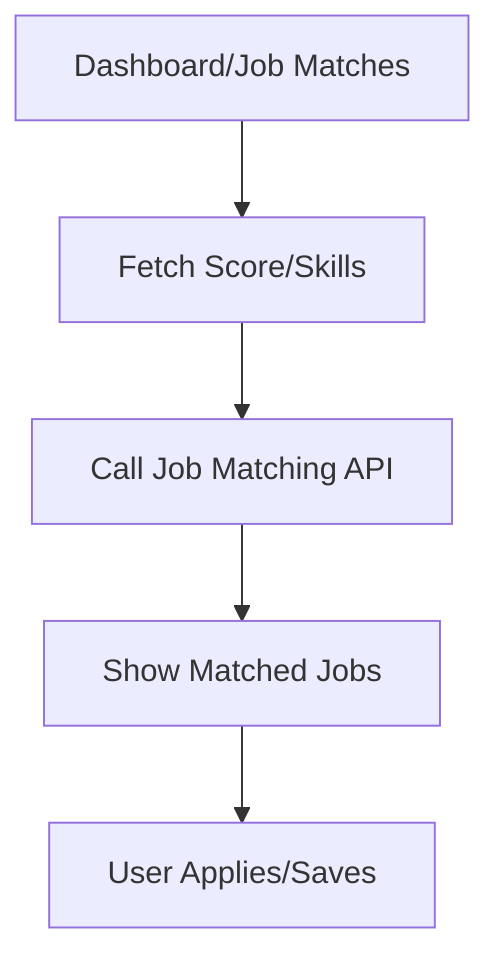

# SkillBridge User Flows

---

## 1. New User Registration & Onboarding

### Steps

1. User lands on `/login` and signs up with Google
2. Redirected to `/onboarding`
3. Step 1: Select career goal
4. Step 2: Self-assess skills
5. Step 3: Upload resume
6. Resume parsed, skills extracted
7. User profile created in Firestore
8. Redirect to `/dashboard`

---

## 2. Skill Gap Analysis Flow

### Steps

1. User navigates to `/skill-gap`
2. Selects/inputs target job role
3. Platform fetches required skills for role
4. Compares with user’s extracted skills
5. Visualizes gaps and strengths
6. Stores gap data in Firestore

---

## 3. Learning Path Generation & Progress

### Steps

1. User visits `/learning-path`
2. Platform generates personalized modules
3. User views modules, resources, mentor tips
4. Completes modules, marks progress
5. Progress tracked, streaks updated
6. Completion unlocks new modules/jobs

---

## 4. Job Readiness Score Calculation

### Steps

1. User visits `/readiness-score`
2. Platform fetches user profile, skills, progress
3. ML model calculates readiness score
4. Score visualized (circular meter, feedback)
5. User sees actionable tips

---

## 5. Job Matching Flow

### Steps

1. User visits `/dashboard` or `/job-matches`
2. Platform fetches readiness score, skills
3. Calls job matching API
4. Shows matched jobs/internships
5. User applies or saves jobs

